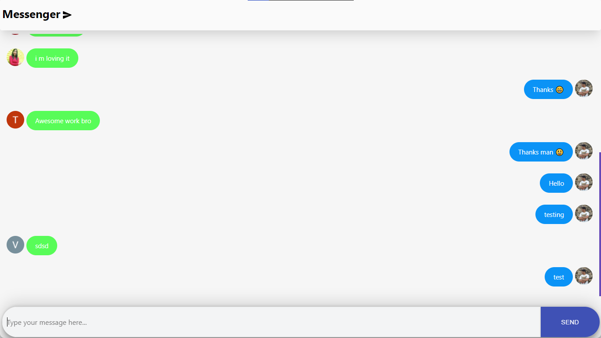

<!-- Please update value in the {}  -->

<h1 align="center" >Messenger 💬</h1>

  <h3>
    <a href="https://chatapp-d7dc1.web.app/">
     >> Demo <<
    </a>   
  </h3>

<!-- OVERVIEW -->

## Overview

  

align="center" 

### About

  This is a Real-time chat app.

### Built With

<!-- This section should list any major frameworks that you built your project using. Here are a few examples.-->

- REACT
- Google FIREBASE

## Contact

- Website [ScriptoPlankton](https://sandeep.netlify.app/)
- GitHub [@sandeepashok](https://github.com/sandeepashok)
- Gmail [Sandeep98a@gmail.com](sandeep98a@gmail.com)

